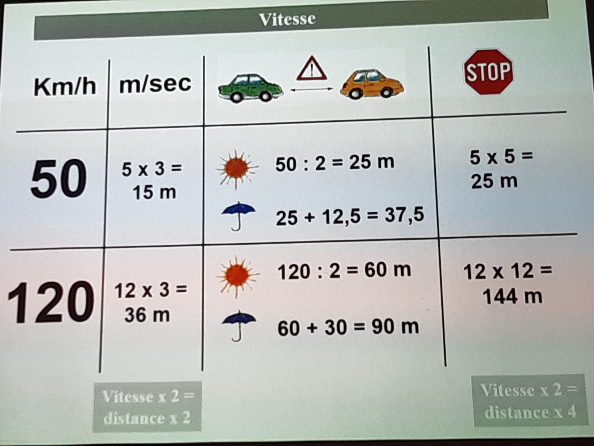
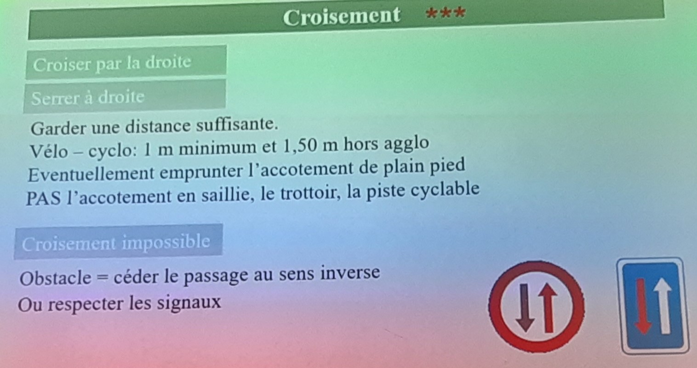
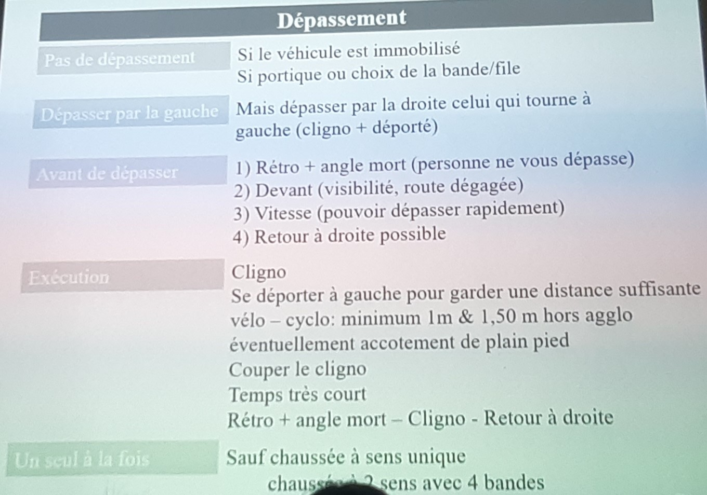
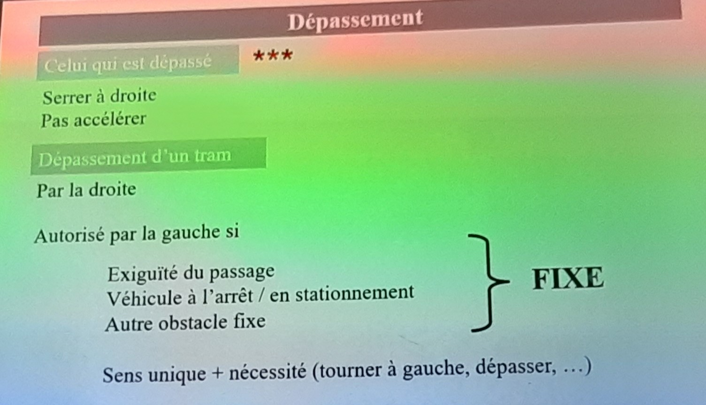
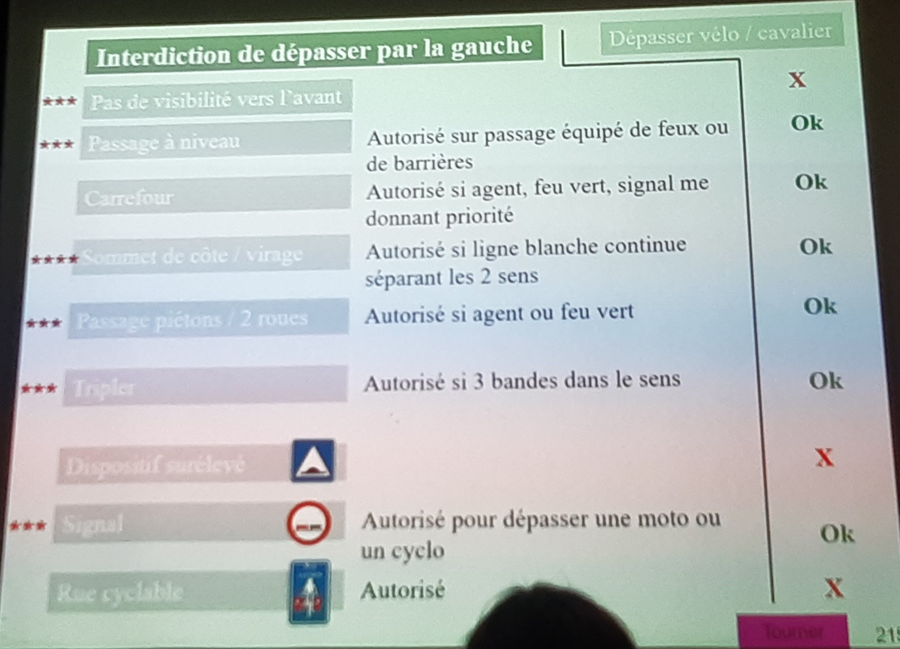
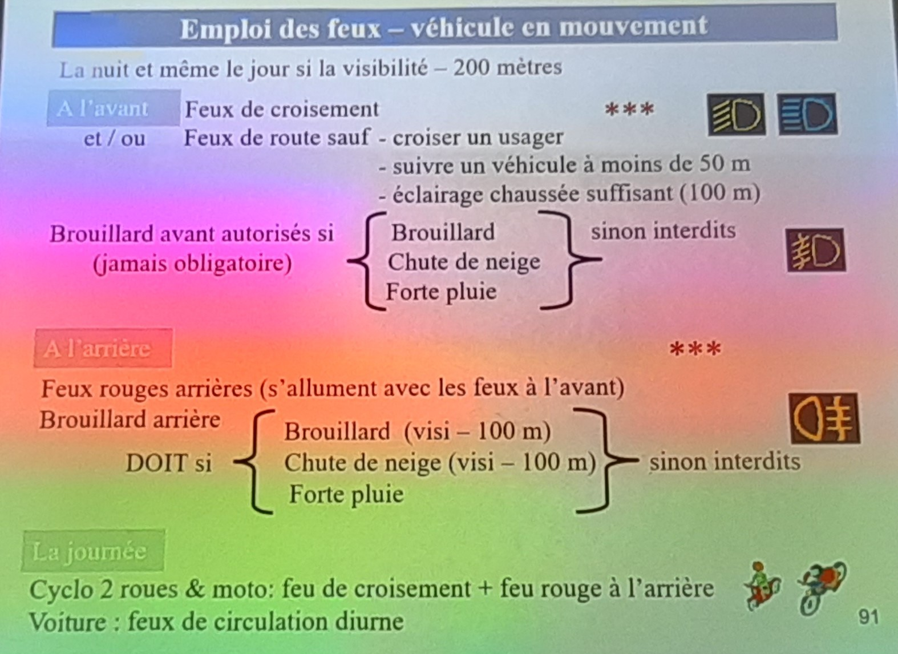
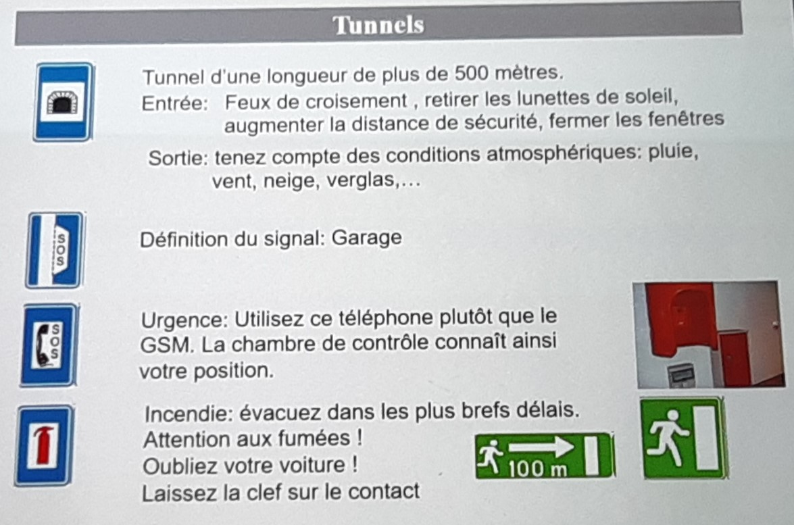
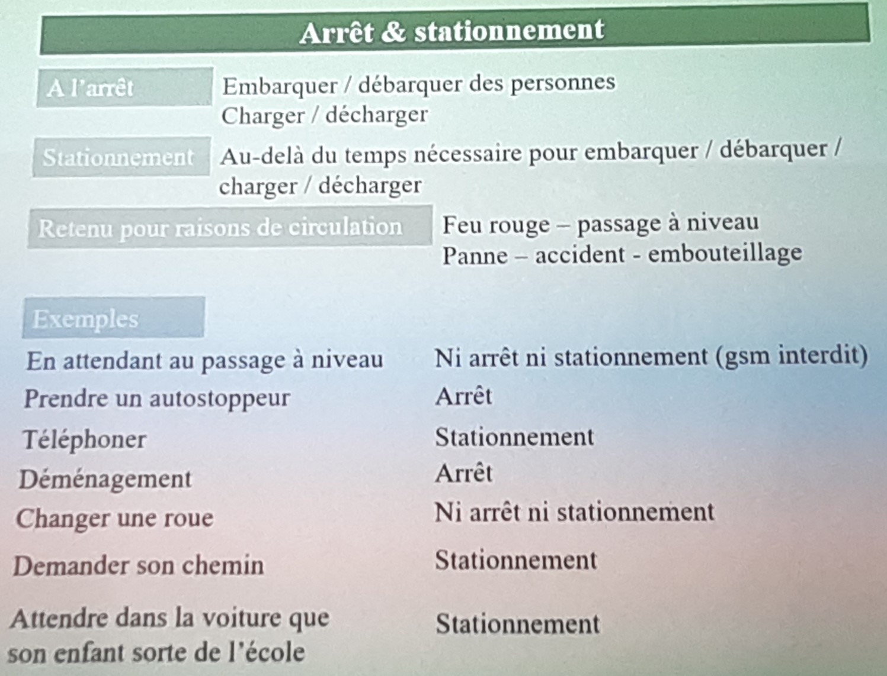
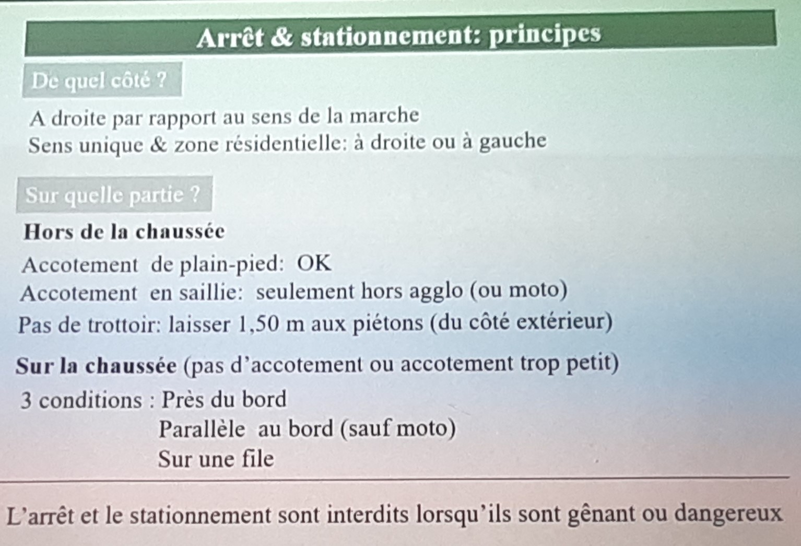
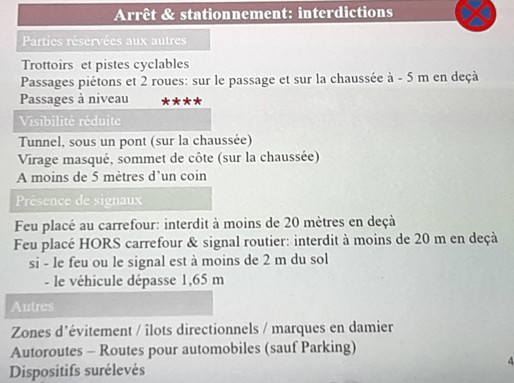

# Permis de conduire théorique

Sites:
- [Le permis belge](https://lepermisbelge.com/) (les examens a partir de 10 devienne difficile)

## JOURS 1
### Priotités
- Bus:
  - En aglomération le bus à priotité lorsqu'il se met en mouvement, ce qui n'est pas le cas hors aglomération.

- Hiérarchie des règles de priorités:
  - Agent
  - Feut
  - Panneau routiers
  - règles de priorités

## JOURS 2

### Signaux d'interdication
 - Le panneau additionel ne s'applique qu'au panneau au dessus et non pas tout les panneau du dessus.
 - Le panneau d'interdicion prend effet immédiatement et ce jusqu'au prochain carrefour
 - La fin de l'interdiction peux prendre fin plus tôt si on crois le panneau de fin de toute interdiction C46

### Panneau de zone
 - Effet Immédiat et ce jusqu'au panneau qui indique le panneau de fin de zone.

### Signaux d'obligationn
- Faire attention au type de panneau, en fonction du type de fleches utiliser il y a obligation ou indication.

### Panneau d'indication
- Ils sont carré soit bleu soit orange.
- Panneau F8 veut dire que le tunnel fait plus que 500 Mètres
- Les panneau d'interdiction dans une **ZONE** ne sont d'application que jusque l'ont croise le même panneau barré.

### Signaux lumineux
- Ils ne sont d'application que lorsqu'il sont allumé.

### Panneau additionel
- Lorsque qu'un panneau de limitation de vitesse lorsqu'ils sont couplé au panneau "Type GXI" ne concerne que les usagés qui sortent de la route principale (bretel de sortie d'auto-route)

### Marquages routier
- Bande réservée aux heures de pointe : Une grosse ligne blanche discontinue constituée de traits plus rapprochés et plus longs que ceux prévus pour les marquages de bandes de circulation délimite une bande réservée aux heures de pointe.
- F17 - Signaux indication - Indication des bandes de circulation d’une chaussée parmi lesquelles une est réservée aux autobus. Elle ne peut être utiliser que vers la fin de la bande pour pouvoir tourner éventuelement dans une rue. Elle peut égelement être utiliser pour le garé à droite de la bande de bus.
- F18 – Signaux indication – Indication d’un site spécial franchissable réservé à la circulation des véhicules des services réguliers de transport en commun. Les lignes sont continues, elles indique une interdiction de stationtionnement de circulation et d'arrêt. Il existe cepandant quelques exceptions:
  - L'interdiction de circulation d'un site spécial franchissable est levé au endroit ou trouve un damier.
  - Si la voiture de devant est à l'arrêt, l'interdiction de ciruler est aussi levée.
  - Si il place de stationnement est disponible à droite du site spécial franchissable, il est autoriser de circuler dessus pour se garé, a condition de respection le sense de circulation pour le stationnement.
- Les pistes cyclables sont délimité de part et d'autres par des lignes discontinue, il est interdit de circuler, stationner et de s'arrêter dessus. Par opposition au piste cyclable suggére ou il est autorisé de circuler et de s'arrêter mais interdiction de stationner (car elle se trouve sur la chaussée).
- Arrêt de bus, il est autorisé de circuler, de s'arrêter mais pas de stationner. Le stationnement est interdier 15mètre devans et derrière le panneau de l'arrêt de bus.
- Zone d'évitemment:
  

### Vitesse de circulation et distance de sécurité

- Pour les panneau de zone étant couplé à un panneau de limitation de vitesse, la vitesse de circulation est d'application jusqu'au prochain panneau identique barré.
- Pour les panneau de limitation normaux, la limitation est d'application jusq'au prochain carrefour.
- Synthèse des vitesses de circulation :
  
- Synthèse des distances de réaction :
  
- Synthèse générale des vitesse :
  
### Feux de détresse:
- En cas de panne.
- Accident.
- En cas d'embouteillage.
### Accessoires obligatoire a avoir dans la voiture
- Gilet de securité (dans l'abitacle)
- Extincteur (dans l'abitacle)
- Trouce de secoure
- Triangle de danger
### Documents obligatoire pour le véhicule
- Carte d'Assurance
- Certificat de conformité
- Certificat d' Immatriculation
- Certificat de contrôle technique
### Pour le conducteur
- Carte Identité
- Permis de conduire
### Sur autoroute
- Max 120KM/h
- Min 70KM/h
- La Vitesse d'insertion minimale est de 70KM/h, l'insertion doit se faire le plus tôt possible.
- En cas de panne:
  - Activé les feux de détresse
  - Le conducteur est obligé de mette le gilet de sécurité qui doit se trouver a porté de main (dans l'habitacle, au même titre que l'extincteur).
  - Mettre le triangle de danger 100mètres (30 mètres dans tout les autres cas)
  - Se mettre dérrière les barrière de sécurité.
- Synthèse autoroute:
  
- Synthèse route pour automobile
  

### Pannes et accident

- Garantir la sécurité et la fluidité du traffic :
  - Mettre le triangle à 30 mètres en aglo, visible par les autres a une distance de au moins 50mètres
  - Mettre les feux de détresse
  - Mettre le gilet (obligatoire sur autoroute et sur route pour automobile), il est conseillé en aglomération.
  - Le remorquale est interdit sur autoroute et sur route pour automobile
- En cas de danger:
  - Protéger
  - Alerter
  - Secourir
- Synthèse panne:
  
  
- Synthèse accident:
  

### Chargement du véhicule

## JOURS 3

### Chargement du véhicule
---
- MbMA = Masse Maximale Autorisé (Masse que la voiture peut supporter), elle est définie par le constructeur. La MMA pour le permit B est de 3500Kg.
- MEC = Masse En Charge, elle equivaut au poid réelle du véhicule à moment précis, avec tout ce qu'il comprote, passagers, conducteurs, chargement, etc.

PS: Tout les panneau qui interdise l'accès à une rue, sont des panneau relative a la masse en charge. Tout les autres concerne la MMA.

### Bandages pneumatiques
---
- TWI = Indique le temoin d'usure des pneus. il est de 1,6mm.
- Types de pneus:
  - Eté
  - Hiver : Conseillé si moin de 7°
  - A clous : du 1/11 au 31/3. Max 90km
  - Chaine
- Les rainures permettens d'écavuter l'eau. Elle ont une profondeure minimale d'1.6mm.
- La pression peut être augementer en cas de long trajet, ou de chargement lourd. Mais en aucun cas elle ne peut être diminué.
- 165/70 R 14 81/T:
  - 165 Largeur en mm
  - 70 Rapport hauteur / largeur (70% des 165)
  - R radial (radial ou diagonale)
  - 14 Diamètre de la jante en pouce
  - 81 Indice de charge
  - T Indice de vitesse
- Pour dévisser la route l'ordre importe peu / inverse des 
- Pour serreur, il faut le faire sous forme de croix / sense horlogique
### Montages des pneus:
---

- Un type de montage de pneur est strictement interdit : Radiaux devant et Diagonaux a l'arrière
- Il faut mètre le même type de pneus par essieux.

- Synthèse pneus:

### Communication
---
- Klaxon
  - Il est interdit de klaxoner sauf en cas de danger imminant.
  - Hors agglomération:
  - De jours: il est autoriser de klaxoner pour signaler le dépassement.
  - De nuit: utiliser les feux de route.
- Clignotants (indicateur de directions):
  - Pour tourner, même si obligé
  - Pour un déplacement latérale, même si obligé
  - Pour dépasser (même un cycliste)
  - Rond-point: pour quitter
- Feu stop:
  - Utiliser avant de freiner (s'allument en poussant la pédale de frein)
- Feu de détresse:
  - Danger imminent
  - Panne ou accident
  - Véhicule de ramassage scolaire
  - Interdit en dehors de ces trois cas.
### Esapce minimum
---
- Nombre de passager limité au nombre de place
- Pas de passager sur les parties extérieurs
- Espace minimum à l'avant: conducteur 55 cm, passager 40 cm.
### Ceinture
---
- Occuper les places équipées en priorité.
- Utilisation obligatoire (a l'avant et a l'arrière). Sauf:
  - Conducteur effectuant une marche arrière
  - Dérogation ministériel pour cause médicale.
### Siège adapter
---
- Autorisé à l'avant.
- Obligation: Si moins 1,35m et moin de 18ans.
- Exceptionnellement il est possible de transporter un enfant sans siège adapter, si il ne s'agit pas de ses propres enfants ou pas de la famille, autorisation de transporter des enfants de plus de 3 ans à l'arrière avec la ceinture.

### Technique de conduite
---

### Conduite écologique et économique

- Liste des carburant du moin pulluant au plus polluant:
  - LPG
  - Essence
  - Diesel à faible teneur en soufre
  - Diesel blanc
  - Diesel rouge

### Alcool & Drogue

- Ethylotest => Soufler (Halaine => alcool)
    - S = Safe (0 à 0,22)
    - A = Alerte (1er degré) (0,22 à 0,8) interdiction de 3h
    - P = Positif (2eme degré) (0,35 à *) interdiction de 6h
 - Si postif un test a l'ethylomètre pour connaitre le taux exacte (il est possible de demander 15min).

### Types d'infractions

### Croisement
Le croisement désigne le fait de rencontre un autre vehicule qui arrive dans le sense inverse. On croise toujours par la droite.

### Dépassement
- Le dépassement doit se faire impérativement par la gauche.
- le seule moment ou le dépassement par le droite est autorisé, c'est lorsque le vehicule devant a indiqué sont intention de tourner a gauche en ayant mis ses cligotant.
- le triplé est strictement interdit.
  

## JOUR 4

### Céder le passage
---
- TRAM:
  - Le tram est toujours prioritaire.  
- BUS:
  - En aglomération, lorsqu'il quitter son arrêt et que ton clignotant est actif, le bus est prioritaire (valable également pour les bus scolaire). Ce qui n'est pas le cas hors agglomération.
- VELO:
  - Le cycle est comme un autre conducteur lorsqu'il arrive pas la droite, il est donc prioritaire.  
  - Un cycliste qui quitte sa piste cycle pour venir sur la chaussé est prioritaire
  - Un cycliste qui traverse la chaussée sur sa piste pour coupé la chaussée n'est pas prioritaire.
  - Lorsqu'un cycliste circule sur sa piste cyclable, il garde la priorité
  - Lorsqu'un cycliste coupe la chaussé, il doit cédé le passage.
  - Un cycliste qui quitte sa piste cyclable pour arriver sur la chaussé garde la priorité.
  - La rue cyclase prend effet du panneau jusqu'au prochain carrefour, sauf si il y a un panneau indiquant la fin de la rue cyclable.
- Piéton:
  - Si il y a un passage pour pieton a moin de 20mètres, il est dans l'obligation de l'emprunter
  - Si il n'y a pas de passage pour pieton a moin de 20mètres, le pieton peut traverser, mais il n'est pas prioritaire.
  - Lorsque qu'il y a changement de direction (la voiture), le piéton est toujours prioritaire
- Véhicule prioritaire:
  - L'usage de la sirène est obligatoire pour qu'il puissent bénéficié de la priorité. Le gyrophare seule n'est pas suffisant pour leur céder la priorité.
- Manoeuvre = Céder le passage a tout les usagers
- Carrefour: Ne s'engager dans un carrefour que si celui est libre histoire de ne pas l'encombrer.
- Sortir du stationnement = laisser la prioriter au rester des usagers
- Principe de la tirette
  - 
  - Un retrecissement de bande est nécéssaire.
  - La presence d'ambouteillages sont obligatoire
  - L'application du principe de la tirette n'est applicable qu'au niveau du retricissement.
  - [Plus d'info](https://www.vias.be/fr/newsroom/principe-de-la-tirette-les-wallons-a-la-traine/#:~:text=Rappel%20du%20principe,un%20m%C3%AAme%20sens%20de%20circulation)

Synthèse céder le passage:

### Changement de direction
---

- Avant de tourner, vérifier que vous pouvez le faire au niveau de la signalisation.
- Avant de trouner:
  - Regarder le retroviseur
  - Mettre le clignotant
  - S'engager
- Modérer l'allure
- Si on veut tourner a droit, se mettre le plus a droite possible.
- Si on veut tourner a gauche, prendre le plus large possible de manière a se retrouver le bande de droite.
- Lorsque l'on change de direction, il faut ceder la priorité
- Sur un bande bus, il est possible d'utiliser les 10 derniers mètres pour tourner a droite.
  
Synthèse:

### Zones lentes autorisées

- Zone résidentiel:
  - L'accès est autorisé
  - Max 20Km
  - Les piétons sont prioritaires
  - Le stationnement est interdit sauf au emplacements autorisé (présence de panneaux)
  - Le sense du stationnement importe peu.
- Dispositif sur élevé:
  - Vitesse max 30Km/h
  - Interdiction de stationer et de s'arrêter

Synthèse

### Zones lentes interdites
- Zone piétonne:
  - Accès interdit sauf au riverins
  - Vitesse max 30Km/h

> La mention "Excepter circulation locale ne modifie pas la vitesse de ciruclation

Synthèse

## Emploi des Feu
- Du plus petit au plus grand:
  - P : Position: Servent a indiquer la position au autre conducteur. S'allume dès que le voiture est démarré.
    - Uniquement à l'arrêt ou en stationnement. On ne cirule pas avec. De nuit comme de jour si la visibilité est inférieur a 200m.
    - Ces feu sont pas obligatoire si l'éclairage publique ne permet pas de voir a un distance de moin de 100m.
  - C : Croisement (a l'avant)
    - Si la visibilité est inférieur à 200m.
    - croiser un usage
  - R : Route (attention feu eblouissant)
    - interdit de les utiliser lorsqu'on croise un autre usager.
    - sauf a moin de 50m
    - Sauf si éclairage chaussé suffisant (100m)
    - A utiliser lorsque la route est mal éclairer.
    - Uniquement si visibilité inférieur a 200m
  - B : Brouillard
    - forte pluie.
    - Brouillard
    - Chute de neige
    - Uniquement les feux de brouillard arrière sont obligatoire. A utiliser uniquement si la visibilité est inférieur a 100m.

> On utilise soit les feu de croisement soit les feux de route, sauf qu'il est interdit les feux de route si il y un risque d'éblouissement.

## Tunnels
- Laisser les clés sur le contacte et sortir par le sortie de secours.
- Vérifier le niveau de carburant avant d'emprunter le tunnel. Si en panne a cause du carubrant, c'est une faute grave.

Synthèse

### Arrêt & Stationnement
---

- Arrêt : Principe d'embarquer ou de débarquer quelque personne ou des choses.
- Stationnement : Au dela du temp qu'il faut pour embarquer ou débarquer quelqu'un ou quelque chose.

Synthèse

### Interdiction d'arrêt et de stationnement

> Le panneau E3 Indique une interdiction de s'arrêt et de stationner sur la chaussé et sur l'accôtement

Après 20h on considère que l'on est le jours suivant.
Entre 19h30 et 20h00 le changement doit se faire.

### Place handicapé:
- Stationnement interdit
- Arrêt interdit

### Disque de stationnenement

A l'arrivé, regler le temps à la demi-heure qui suit. Ex: Si arriver a 14h45, mettre le disque a 15h

Synthèse

### Stationnement alterné ou semi-mensuel

-  Du 1/15 obligé de stationner de stationner impaire
- Du 16 à la fin du mois obligé de stationner du côté pair

### Conclusion & Numero du moniteur
0496 72 69 18